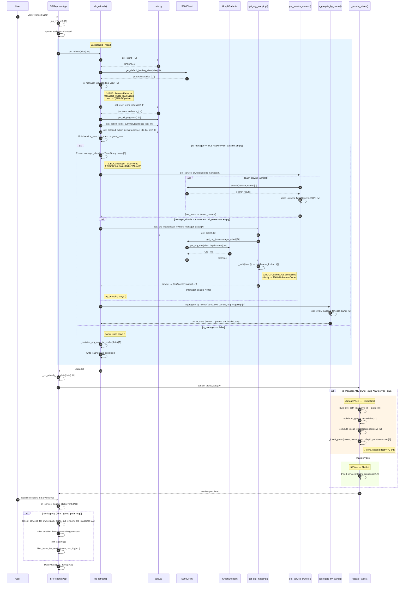

# Services View — Call Flow (UML Sequence Diagram)

## Legend — Entry Points

| Ref | Function / Method | File | Line |
|-----|-------------------|------|------|
| **A** | `SFIReporterApp._on_refresh()` | `tk_app.py` | 3284 |
| **B** | `do_refresh(user_alias, on_status)` | `tk_app.py` | 625 |
| **C** | `get_client()` | `data.py` | 134 |
| **D** | `S360Client.get_default_landing_view(alias)` | `accia_s360/client.py` | 495 |
| **E** | `is_manager_view(landing_view)` | `tk_app.py` | 289 |
| **F** | `get_user_team_info(alias)` | `data.py` | 171 |
| **G** | `get_all_programs()` | `data.py` | 522 |
| **H** | `get_action_items_summary(audience_ids)` | `data.py` | 261 |
| **I** | `get_detailed_action_items(audience_ids, kpi_ids)` | `data.py` | 373 |
| **J** | Manager alias extraction (inline) | `tk_app.py` | 767–782 |
| **K** | `get_service_owners(unique_names)` | `tk_app.py` | 583 |
| **L** | `S360Client.search(service_name)` | `accia_s360/client.py` | ~150 |
| **M** | `parse_owners_field(owners_json)` | `tk_app.py` | 306 |
| **N** | `get_org_mapping(all_owners, manager_alias)` | `tk_app.py` | 329 |
| **O** | `S360Client.get_org_tree(alias)` | `accia_s360/client.py` | 97 |
| **P** | `GraphEndpoint.get_org_tree(alias, depth=None)` | `accia_s360/endpoints/graph.py` | 215 |
| **Q** | `_walk(node, parent_path)` (closure) | `tk_app.py` | 374 |
| **R** | `aggregate_by_owner(items, svc_owners, org_mapping)` | `tk_app.py` | 425 |
| **S** | `_get_level1(mapped)` (closure) | `tk_app.py` | 458 |
| **T** | `_serialize_org_data_for_cache(data)` | `tk_app.py` | 31 |
| **U** | `SFIReporterApp._on_refresh_complete(data)` | `tk_app.py` | 3307 |
| **V** | `SFIReporterApp._update_tables(data)` | `tk_app.py` | 2805 |
| **W** | `svc_path_map` construction (inline) | `tk_app.py` | 2859 |
| **X** | `root_groups` construction (inline) | `tk_app.py` | 2880 |
| **Y** | `_compute_group_stats(group)` (closure) | `tk_app.py` | 2908 |
| **Z** | `_insert_group(parent, name, group, depth, path)` (closure) | `tk_app.py` | 2933 |
| **AA** | IC flat insertion (inline) | `tk_app.py` | 2968 |
| **AB** | `SFIReporterApp._on_service_double_click(event)` | `tk_app.py` | 3020 |
| **AC** | `collect_services_for_owner(path_prefix, svc_owners, org_mapping)` | `tk_app.py` | 536 |
| **AD** | `filter_items_by_service(items, svc_id)` | `tk_app.py` | 837 |
| **AE** | `DetailModal(root, title, items, ...)` | `tk_app.py` | ~1100 |

## Known Bugs in Flow

| Bug | Location | Impact |
|-----|----------|--------|
| **`is_manager_view` false negative** | **E** (line 289) | If brentj's landing view has a TeamGroup but the detection fails, `is_manager=False` → IC flat view shown for a manager |
| **Silent exception in `get_org_tree`** | **Q** (line 366) | Any exception → all owners become "Unknown Owner" with no logging |
| **`manager_alias` extraction fragile** | **J** (line 773) | Requires `"Team Name (ALIAS)"` format — `None` if pattern absent → `org_mapping` stays `{}` |
| **Name format mismatch** | **Q** vs **M** | Graph `display_name` ("First Last") may differ from S360 owners ("Last, First") → lookups miss |
