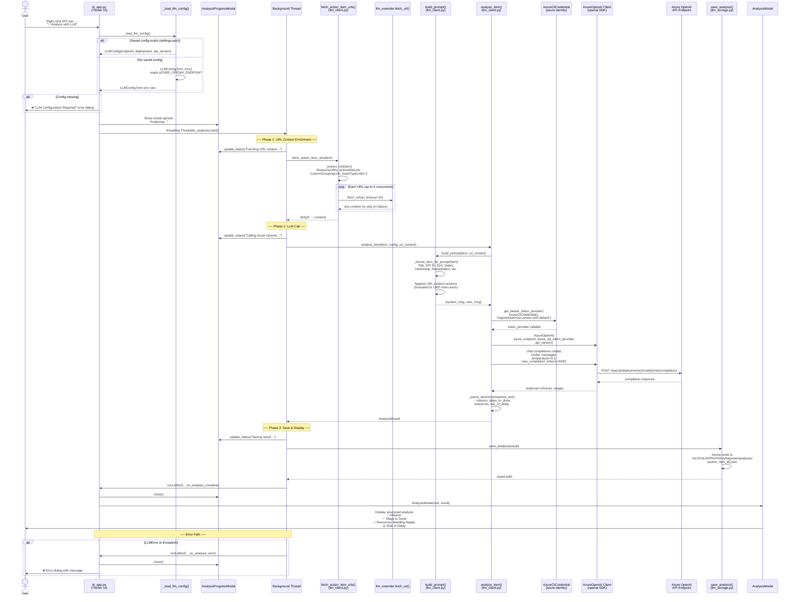

# Analyze with LLM — Feature Overview

## Summary

The **Analyze with LLM** feature sends an SFI action item's data to Azure OpenAI
for a structured remediation analysis. The result includes four sections:
Mission, Steps to Done, Resources Needing Repair, and Risk of Delay.

Authentication uses **Azure CLI credential** (`az login`) — no API keys are needed.

## UML Sequence Diagram

## Key Components

| Component | File | Role |
|-----------|------|------|
| `_launch_llm_analysis()` | `tk_app.py` | Entry point — validates config, spawns background thread |
| `_load_llm_config()` | `tk_app.py` | Loads config from saved settings or env vars |
| `ConfigureLLMDialog` | `tk_app.py` | UI dialog to configure/detect endpoint settings |
| `fetch_action_item_urls()` | `llm_client.py` | Extracts & fetches URLs from action item fields |
| `build_prompt()` | `llm_client.py` | Constructs system + user messages for the LLM |
| `analyze_item()` | `llm_client.py` | Authenticates via Azure CLI, calls Azure OpenAI, parses response |
| `_parse_sections()` | `llm_client.py` | Splits LLM response into 4 named sections |
| `save_analysis()` | `llm_storage.py` | Atomic write of result to local JSON file |
| `AnalysisProgressModal` | `tk_app.py` | Spinner dialog shown during processing |
| `AnalysisModal` | `tk_app.py` | Displays the structured analysis result |

## Authentication

No API keys are used. The `AzureOpenAI` client authenticates via
`azure.identity.AzureCliCredential` with a token scoped to
`https://cognitiveservices.azure.com/.default`. Users must run `az login` first.

## Configuration Sources (priority order)

1. **Saved settings** — `%TEMP%/sfireporter/settings.json` (set via ⚙️ Configure LLM dialog)
2. **Environment variables** — `AZURE_OPENAI_ENDPOINT`, `AZURE_OPENAI_DEPLOYMENT`, `AZURE_OPENAI_API_VERSION`
